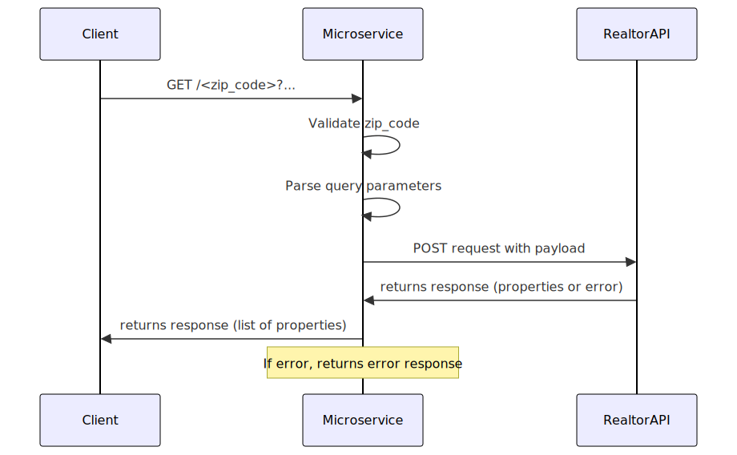

# listings-microservice

## How to Run the Microservice

I have provided a devcontainer which provides a Docker environment containing all the tools necessary to run the program. Please refer to [Developing inside a Container](https://code.visualstudio.com/docs/devcontainers/containers) for more information about container development.

If you already have Python installed on your computer, you can also install the necessary requirements in a [virtual environemnet](https://docs.python.org/3/tutorial/venv.html).

You will need to create a `.env` file with API key and host for the [Realtor API](https://rapidapi.com/Champlion/api/realtor-com4). See `.env.public` for how that should look.

Once you have the environment ready, you can run the server with: `make dev` or `python main.py`.

## How to Request Data

This microservice is an HTTP API. To request listings data, make a [GET](https://developer.mozilla.org/en-US/docs/Web/HTTP/Methods/GET) request to the root directoy.

### Description
`GET /<zip_code>`: Retrieve a list of property listings in a specified zip code with optional filters for price, square footage, number of bedrooms, and bathrooms.

### Path Parameters
| Parameter  | Required | Description                                      |
|------------|----------|--------------------------------------------------|
| `zip_code` | Yes      | A 5-digit postal code. Must be numeric and exactly 5 digits long. |


### Query Parameters
| Parameter   | Required | Default | Description                         |
|-------------|----------|---------|-------------------------------------|
| `limit`     | No       | 10      | The maximum number of listings to return. |
| `max_price` | No       | None    | The maximum price of the listings.  |
| `max_sqft`  | No       | None    | The maximum square footage of the listings. |
| `max_beds`  | No       | None    | The maximum number of bedrooms.     |
| `max_baths` | No       | None    | The maximum number of bathrooms.    |

### Request Example
```http
GET /97370?limit=5&max_price=400000&max_sqft=2500&max_beds=3&max_baths=2
```

If you have the server running locally on the default port:

[http://127.0.0.1:5000/97370?limit=3&max_price=400000&max_sqft=2500](http://127.0.0.1:5000/97370?limit=3&max_price=400000&max_sqft=2500)

## How to Receive Data

Python example using the [requests](https://pypi.org/project/requests/) library:

```
import requests

zip_code = "97370"
try:
    response = requests.get(f"http://127.0.0.1:5000/{zip_code}", params={
        "limit": 3,
        "max_price": 400000,
        "max_sqft": 2500,
        "max_beds": 3,
        "max_baths": 2,
    })
    response.raise_for_status()
    listings = response.json()
    # Read listings data

except requests.exceptions.HTTPError as http_err:
    print(f"HTTP error occurred: {http_err}")

except requests.exceptions.RequestException as req_err:
    print(f"Request error occurred: {req_err}")

```

### UML


